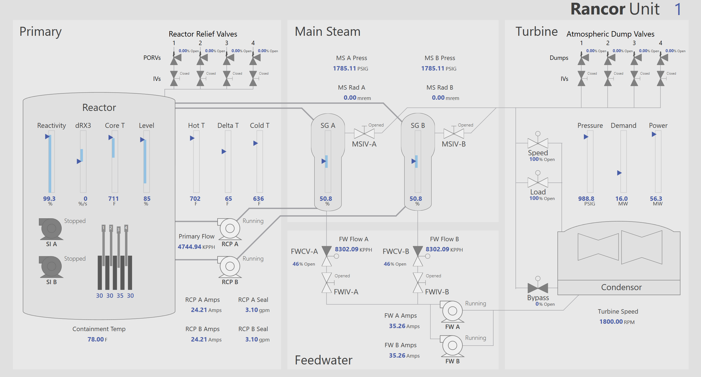

class: center, middle

## Development of a Dynamic Cognitive Modeling Architecture of Human Reliability Simulation using the Rancor Microworld Simulator

##### Roger Lew<sup>a</sup>, Torrey Mortenson<sup>b</sup>, Ronald L Boring<sup>c</sup>, and Thomas A Ulrich<sup>d</sup>

<sup>b</sup>,University of Idaho, Moscow, ID, USA, rogerlew@uidaho.edu

<sup>b</sup>,Idaho National Laborarory, Idaho Falls, ID, USA, torrey.mortenson@inl.gov

<sup>c</sup>,Idaho National Laborarory, Idaho Falls, ID, USA, ronald.boring@inl.gov

<sup>d</sup>,Idaho National Laborarory, Idaho Falls, ID, USA, thomas.ulrich@inl.gov

---

## Introduction

- Nuclear Plants are complex socio-technical systems
- Need to understand propensity and implications of human-error
- Traditional HRA methods are static (estimated per task) and subjective

---


## Dynamic Human Reliability Analysis

### Broad goals

- Utilize symbolic model of human cognition rather than expert-based empirical models
  - ACT-R's declarative memory model (PyACTUp, PyIBL)
- Integrative modeling with plant simulators
  - important to understand the impact of decisions to plant performance
  - estimate PSFs based on dynamic plant conditions
- Couple to HUNTER to create virtual operator
  - real-time operator
  - monte-carlo simulations

---

## ACT-R (Adaptive Control of Thought—Rational)

- Originated in 1973 (John R. Anderson)
- Cognitive modeling framework
- Specifies how the brain is organized, and how its organization gives birth to what is perceived, remembered, and retrieved
- Modules
  - Perceptual Motor
  - Declarative Memory
  - Procedural Memory

---

## ACT-R Declarative Memory

Knowledge of facts (e.g. Paris is the capital of France)

Can model several known memory limitations:
- fan effect
- primacy and recency effects
- serial recall performance

Decades of studies, good understanding of default parameters that yield reasonable results

---

## Cognitive Model

### How does it work?

- Model learns vectorized problem space
- Learns "chunks" which are vectorized representations of the plant state
- Can also explicitly be given "utility" of chunks
- Once trained can be given a partial representation and retrieves closest match with utility weighting

---

## Rancor Microworld 

Full-scope simulators contain tens-thousands of parameters.
Need something easier to decompose to build and validate cognitive model.

- Rancor Microworld is a Simplified Nuclear Power Plant Simulator
- Has the major systems and components of a PWR
- Reduced complexity to allow naive operators to quickly learn and operate it
- Lots of experience and available data
  - (Plants have data but it is inaccessible)

---



---

### Rancor Microworld Parameter Discretization Schemes

<table>
    <thead>
        <tr>
            <td>Parameter Type</td>
            <td>Discretization</td>
        </tr>
    </thead>
    <tbody>
        <tr>
            <td>Alarm</td>
            <td>N/A, False, True</td>
        </tr>
        <tr>
            <td>Reactivity</td>
            <td>N/A, Offline (0%), Online (0% - 100%), Over-Power (100%-102.5%), Over Trip Threshold (&gt;102.5%)</td>
        </tr>
        <tr>
            <td>Pump State</td>
            <td>N/A, Off, On</td>
        </tr>
        <tr>
            <td>SG Level</td>
            <td>N/A, Low (&lt;40%), Normal (40%-60%), High (60%)</td>
        </tr>
        <tr>
            <td>Valve</td>
            <td>N/A, Closed (0%), Open (&gt;0%)</td>
        </tr>
        <tr>
            <td>Latched</td>
            <td>N/A, Not Latched, Latched</td>
        </tr>
      </tbody>
</table>

---

### Example: Controlling Steam Generator Levels

```
plant       alarm       alarm       SG A        SG B        Δ SG A      Δ SG B      response            comments
mode        high sg     low sg      level       level       level       level
------------------------------------------------------------------------------------------------------------------------
Shutdown    *           *           *           *           *           *           None
*           *           *           *           *           *           *           determine plant     low SA
                                                                                    mode
Online/     *           *           normal      *           ↑           *           ↓CV A               ahead of alarm
Startup
Online/     *           *           high        *           ↑           *           ↓CV A               after alarm 
Startup
Online/     *           *           high        *           ~           *           ↓CV A               way after alarm 
Startup
Online/     *           *           *           normal      *           ↑           ↓CV B               ahead of alarm
Startup
Online/     *           *           *           high        *           ↑           ↓CV B               after alarm 
Startup
Online/     *           *           *           high        *           ~           ↓CV B               way after alarm 
Startup
Online/     *           *           normal      *           ↓           *           ↑CV A               ahead of alarm
Startup
Online/     *           *           low         *           ↓           *           ↑CV A               after alarm 
Startup
Online/     *           *           low         *           ~           *           ↑CV A               way after alarm 
Startup
Online/     *           *           *           normal      *           ↓           ↑CV B               ahead of alarm
Startup
Online/     *           *           *           low         *           ↓           ↑CV B               after alarm 
Startup
Online/     *           *           *           low         *           ~           ↑CV B               way after alarm 
Startup
Online/     True        *           *           *           *           *           investigate high    low SA 
Startup
Online/     *           True        *           *           *           *           investigate low     low SA 
Startup
```

---

### Lessons Learned

- Models require discretization of continuous variables
- ACT-R
  - Can learn 1 to 1 alarm mappings
  - Can learn alarm prioritization of multiple alarms
  - Can learn to ignore extraneous variables
  - Can learn how to qualitatively identify plant state
  - Can learn control actions
- Larger dimensional chunks take more time to train
- Extraneous variables take longer to train
- Performance can be calibrated by
  - manipulating training repetitions
  - manipulating the accuracy of the learning chunks
  - adding extraneous variables

---

## Next step: Operator Model

- Hierarchical declarative memory models
  - plant overview
  - annuciator response -> alarm immediate actions
  - alarm immediate actions -> procedure
- Flow based on ethnographic studies working with operators
  - Walking the boards to assess plant state
  - Looking for contradictory indications
  - Receive Action -> Verify Action -> Carryout Action -> Peercheck -> Validate System Response
  - Spidey sense awareness of plant state
- Scaffold approach: get it working, refine latter

---

## Conclusions and Discussion

- Primary goal is to model human performance
- Safety I vs. Safety II
  - Understand human contribution to resilient human/machine system
- Automated systems based on virtual operator models 
